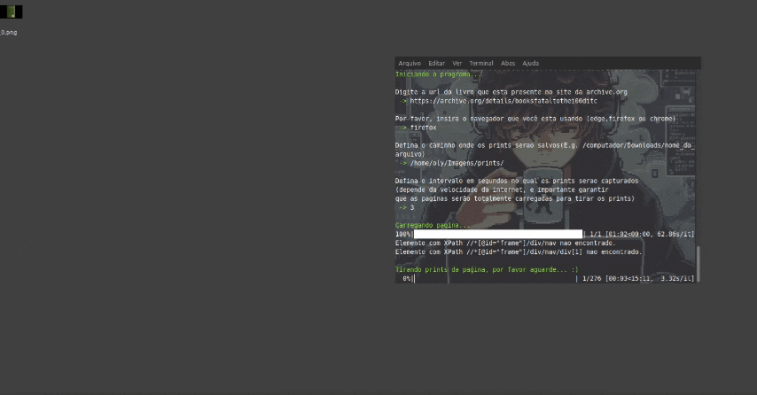

## Como usar

1. Baixe o executavel do programa em Releases disponível na página oficial do projeto no github: [Releases](https://github.com/GustavoOly/Archive.org-Books-Screenshots/releases/)
2. Após o download, execute o programa baixado. 
3. Em seguida alguns procedimentos serão solicitados:
   - Insira o link do livro disponível em archive.org;
   - Insira o navegador que será utilizado: chrome, edge ou firefox;
   - Insira o diretório onde os prints serão armazenados;
   - Insira o tempo em segundos no qual cada print será capturado (escolha considerando a velocidade de sua internet);
4. Bibbidi Bobbidi-Boo :magic_wand: seus prints já estarão sendo capturados :slightly_smiling_face:.

## Dependências de desenvolvimento

- Selenium

```shell
pip3 install selenium
```

- Webdriver-manager

```shell
pip3 install webdriver-manager
```

- tqdm

```shell
pip3 install tqdm
```